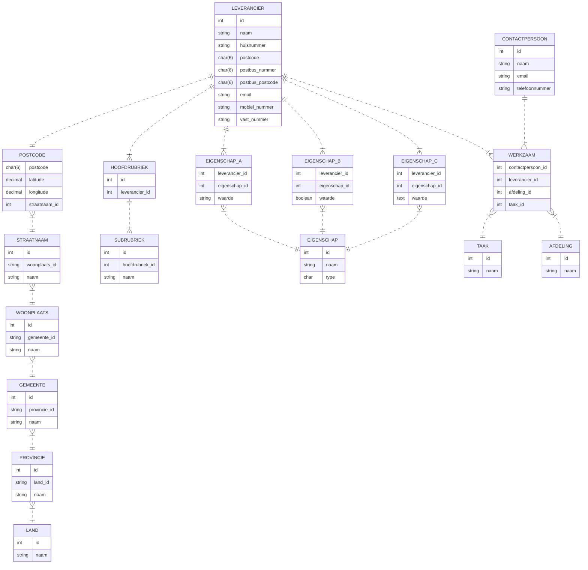

Voordat we gaan bekijken hoe een relationele database met behulp van SQL te ondervragen, is het handig om eerst een beeld te krijgen wat een relationele database is hoe deze tot stand komt.

Hiervoor gaan we een 6-tal opdrachten doen:

* Aan hand van de module 'Gegevens Analyse' gaan je de eerste opdracht [#2] maken: het samenstellen van een ERD op basis van een beschrijving van een gewenst informatiesysteem. Je leert in-a-nutshell hoe je een gegevensverzameling kunt modelleren en hoe de relaties te duiden en vast te leggen in schema's.

* In opdracht 2 [#3] gaan we kijken of je van een bestaande complexe database een compleet ERD kan maken.
* In opdracht 3 [#4] kijken we naar eenvoudige SELECT met daarnaast filtering (WHERE) en sorteren (ORDER BY).
* In opdracht 4 [#5] kijken we naar SELECT uit meerdere tabellen met verschillende soorten JOINS zonder en met NULL waarden
* In opdracht 5 [#6] kijken we naar tellen, rekenen, groeperen (GROUP BY), IF-CASE en VIEWs
* In opdracht 6 [#7] tenslotte hebben we INNER SELECTs, sub-queries en datum- en string manipulatie

Optioneel kan je daarna nog een verdieping in SQL [#8] doen met o.a. stored procerudals etc.

### Opdracht 1

