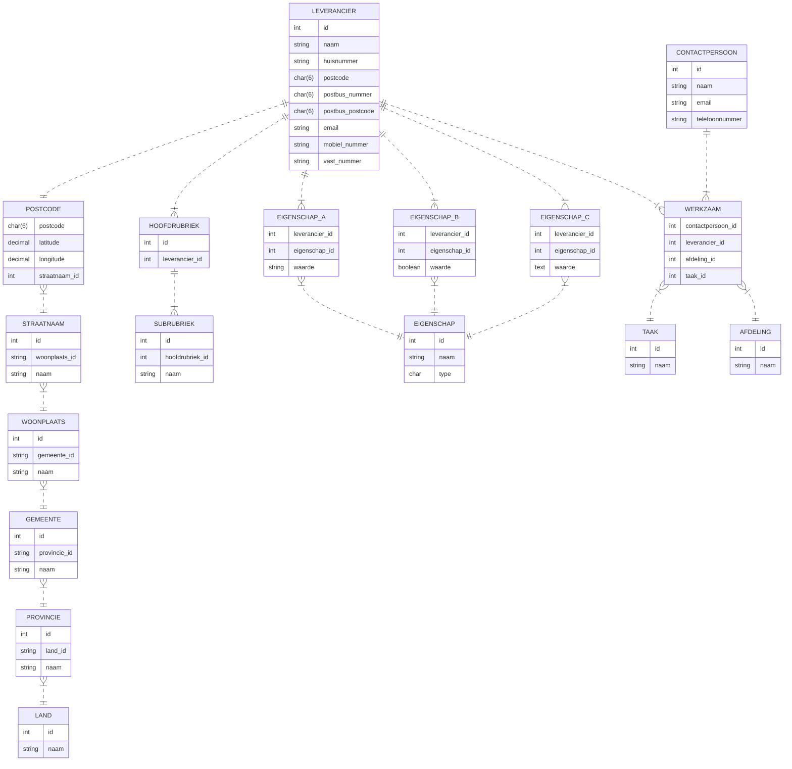

```mermaid
erDiagram
    LEVERANCIER {
        int id
        string naam
        string huisnummer
        char(6) postcode
        char(6) postbus_nummer
        char(6) postbus_postcode
        string email
        string mobiel_nummer
        string vast_nummer
    }

    EIGENSCHAP {
        int id
        string naam
        char type
    }
    EIGENSCHAP_A {
        int leverancier_id
        int eigenschap_id
        string waarde
    }
    EIGENSCHAP_B {
        int leverancier_id
        int eigenschap_id
        boolean waarde
    }
    EIGENSCHAP_C {
        int leverancier_id
        int eigenschap_id
        text waarde
    }

    HOOFDRUBRIEK {
        int id
        int leverancier_id
    }
    SUBRUBRIEK {
        int id
        int hoofdrubriek_id
        string naam
    }

    WERKZAAM {
        int contactpersoon_id
        int leverancier_id
        int afdeling_id
        int taak_id
    }
    CONTACTPERSOON {
        int id
        string naam
        string email
        string telefoonnummer
    }
    AFDELING {
        int id
        string naam
    }
    TAAK {
        int id
        string naam
    }

    POSTCODE {
        char(6) postcode
        decimal latitude
        decimal longitude
        int straatnaam_id
    }
    STRAATNAAM {
        int id
        string woonplaats_id
        string naam
    }
    WOONPLAATS {
        int id
        string gemeente_id
        string naam
    }
    GEMEENTE {
        int id
        string provincie_id
        string naam
    }
    PROVINCIE {
        int id
        string land_id
        string naam
    }
    LAND {
        int id
        string naam
    }

    LEVERANCIER ||..|| POSTCODE : ""
    LEVERANCIER ||..|{ HOOFDRUBRIEK : ""
    HOOFDRUBRIEK ||..|{ SUBRUBRIEK : ""

    EIGENSCHAP_A }|..|| EIGENSCHAP : ""
    EIGENSCHAP_B }|..|| EIGENSCHAP : ""
    EIGENSCHAP_C }|..|| EIGENSCHAP : ""
    LEVERANCIER ||..|{ EIGENSCHAP_A : ""
    LEVERANCIER ||..|{ EIGENSCHAP_B : ""
    LEVERANCIER ||..|{ EIGENSCHAP_C : ""

    LEVERANCIER ||..|{ WERKZAAM : ""
    WERKZAAM }|..|| TAAK : ""
    WERKZAAM }|..|| AFDELING : ""
    CONTACTPERSOON ||..|{ WERKZAAM : ""

    POSTCODE }|..|| STRAATNAAM : ""
    PROVINCIE }|..|| LAND : ""
    GEMEENTE }|..|| PROVINCIE : ""
    WOONPLAATS }|..|| GEMEENTE : ""
    STRAATNAAM }|..|| WOONPLAATS : ""
```