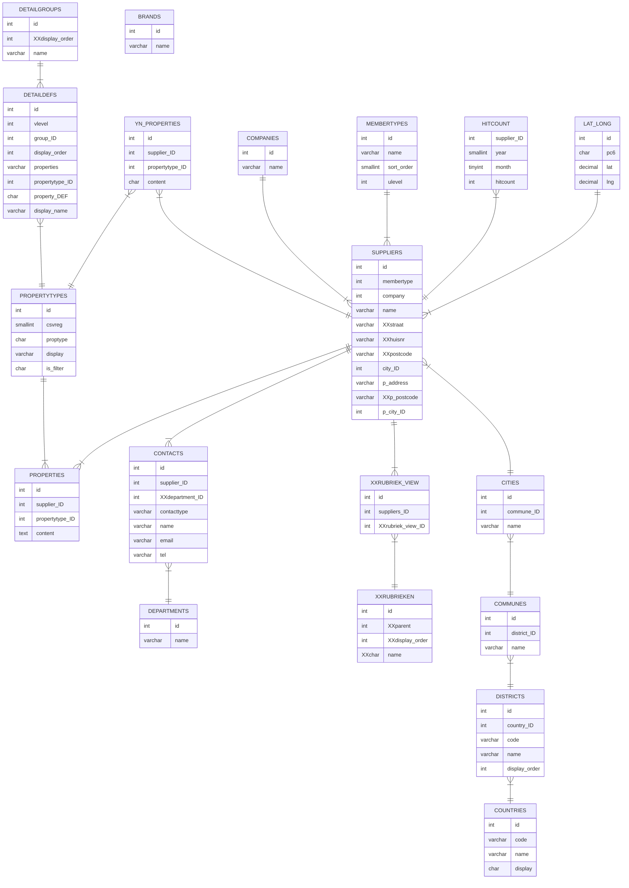

```mermaid
erDiagram
    
    DETAILDEFS }|--|| PROPERTYTYPES : ""
    DETAILGROUPS ||--|{ DETAILDEFS : ""
    YN_PROPERTIES }|--|| PROPERTYTYPES : ""
    YN_PROPERTIES }|--|| SUPPLIERS : ""
    PROPERTYTYPES ||--|{ PROPERTIES : ""
    SUPPLIERS ||--|{ PROPERTIES : ""
    
    COMPANIES ||--|{ SUPPLIERS : ""

    SUPPLIERS ||--|{ CONTACTS : ""
    CONTACTS }|--|| DEPARTMENTS : ""

    MEMBERTYPES ||--|{ SUPPLIERS : ""

    HITCOUNT }|--|| SUPPLIERS : ""
    
    XXRUBRIEK_VIEW }|--|| XXRUBRIEKEN : ""
    SUPPLIERS ||--|{ XXRUBRIEK_VIEW : ""

    LAT_LONG ||--|{ SUPPLIERS : ""
    CITIES }|--|| COMMUNES : ""
    COMMUNES }|--|| DISTRICTS : ""
    DISTRICTS }|--|| COUNTRIES : ""
    SUPPLIERS }|--|| CITIES : ""

    SUPPLIERS {
        int id
        int membertype
        int company
        varchar name
        varchar XXstraat
        varchar XXhuisnr
        varchar XXpostcode
        int city_ID
        varchar p_address
        varchar XXp_postcode
        int p_city_ID
    }

    CONTACTS {
        int id
        int supplier_ID
        int XXdepartment_ID
        varchar contacttype
        varchar name
        varchar email
        varchar tel
    }
    DEPARTMENTS {
        int id
        varchar name
    }

    XXRUBRIEKEN {
        int id
        int XXparent
        int XXdisplay_order
        XXchar name
    }
    XXRUBRIEK_VIEW {
        int id
        int suppliers_ID
        int XXrubriek_view_ID
    }

    CITIES {
        int id
        int commune_ID
        varchar name
    }
    COMMUNES {
        int id
        int district_ID
        varchar name
    }
    DISTRICTS {
        int id
        int country_ID
        varchar code
        varchar name
        int display_order
    }
    COUNTRIES {
        int id
        varchar code
        varchar name
        char display
    }

    PROPERTYTYPES {
        int id
        smallint csvreg
        char proptype
        varchar display
        char is_filter
    }
    PROPERTIES {
        int id
        int supplier_ID
        int propertytype_ID
        text content
    }
    YN_PROPERTIES {
        int id
        int supplier_ID
        int propertytype_ID
        char content
    }

    MEMBERTYPES {
        int id
        varchar name
        smallint sort_order
        int ulevel
    }

    COMPANIES {
        int id
        varchar name
    }

    BRANDS {
        int id
        varchar name
    }

    LAT_LONG {
        int id
        char pc6
        decimal lat
        decimal lng
    }

    HITCOUNT {
        int supplier_ID
        smallint year
        tinyint month
        int hitcount
    }

    DETAILGROUPS {
        int id
        int XXdisplay_order
        varchar name
    }

    DETAILDEFS {
        int id
        int vlevel
        int group_ID
        int display_order
        varchar properties
        int propertytype_ID
        char property_DEF
        varchar display_name
    }

```